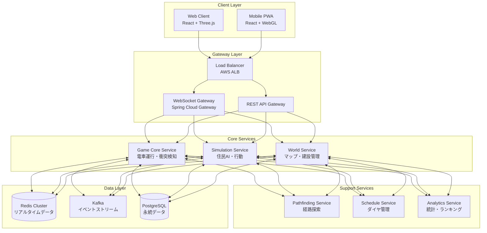
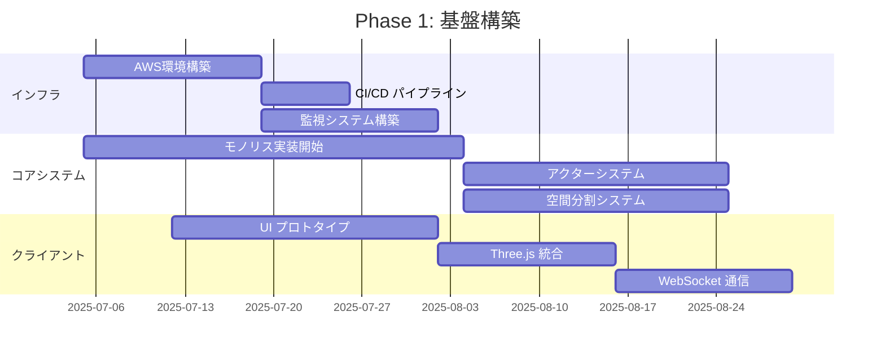
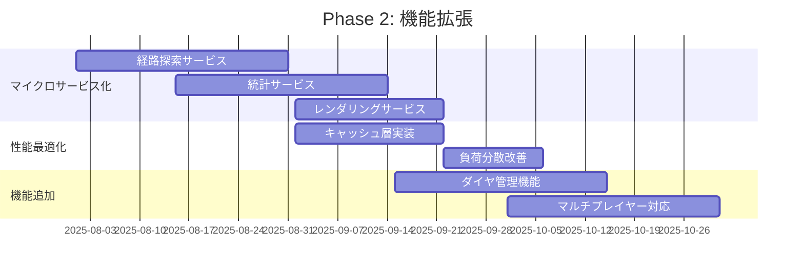
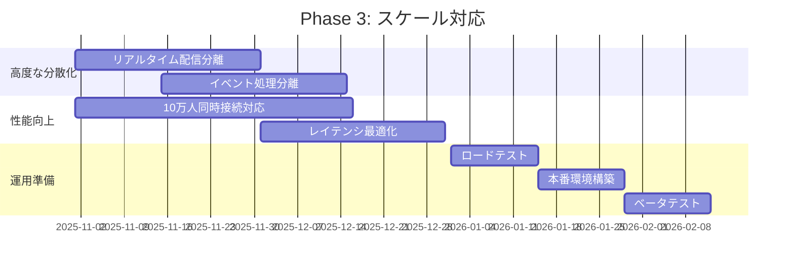

提供いただいたプロジェクトナレッジを基に、鉄道シミュレーションゲームの開発計画と進捗管理方法を提案いたします。

## 1. 要件の具体化

### 機能要件
```yaml
# コアゲームプレイ
- 鉄道敷設:
  - リアルタイム線路配置
  - 駅建設（最大1000駅/マップ）
  - 信号・分岐器設置
  
- シミュレーション:
  - 電車運行: 100-5000編成同時運行
  - 住民AI: 1万-50万人の経路探索
  - ダイヤ: 自動/手動スケジューリング
  
- マルチプレイヤー:
  - 同時接続: 100-1000人/マップ
  - 協調/競合モード
  - リアルタイム同期

# 非機能要件
- レスポンス: 位置更新30fps、操作反映<100ms
- 可用性: 99.9%（計画停止除く）
- スケーラビリティ: 水平スケール対応
```

### パフォーマンス目標
```javascript
// クライアント側
const PERFORMANCE_TARGETS = {
  renderingFPS: 60,          // 描画フレームレート
  networkUpdateRate: 10,     // サーバー更新頻度(Hz)
  visibleEntities: {
    zoom100: 1000,          // 最大ズーム時の表示数
    zoom50: 5000,           // 中間ズーム
    zoom10: 'heatmap'       // 広域表示はヒートマップ
  }
};

// サーバー側
const SERVER_TARGETS = {
  simulationTick: 33,       // 30fps相当
  pathfindingBudget: 100,   // ms/frame
  broadcastInterval: 100    // ms
};
```

## 2. 全体アーキテクチャ

### システム構成図


## 3. 技術選定の詳細

### バックエンド技術スタック
```java
// build.gradle (ルート)
plugins {
    id 'java'
    id 'org.springframework.boot' version '3.2.0'
    id 'com.google.protobuf' version '0.9.4'
}

dependencies {
    // Core Framework
    implementation 'org.springframework.boot:spring-boot-starter-webflux'
    implementation 'org.springframework.cloud:spring-cloud-starter-gateway'
    
    // Distributed Computing
    implementation 'org.apache.kafka:kafka-streams:3.6.0'
    implementation 'com.hazelcast:hazelcast:5.3.0'
    implementation 'io.projectreactor:reactor-core:3.6.0'
    
    // Performance
    implementation 'com.github.ben-manes.caffeine:caffeine:3.1.8'
    implementation 'io.netty:netty-transport-native-epoll:4.1.100.Final'
    
    // Monitoring
    implementation 'io.micrometer:micrometer-registry-prometheus:1.12.0'
    implementation 'io.opentelemetry:opentelemetry-api:1.32.0'
}
```

### フロントエンド技術スタック
```json
{
  "dependencies": {
    "react": "^18.2.0",
    "three": "^0.160.0",
    "@react-three/fiber": "^8.15.0",
    "@react-three/drei": "^9.92.0",
    "zustand": "^4.4.0",
    "socket.io-client": "^4.7.0",
    "@tanstack/react-query": "^5.17.0",
    "react-map-gl": "^7.1.0",
    "deck.gl": "^9.0.0"
  }
}
```

## 4. モノレポ構成（改訂版）

```
railway-simulation/
├── .github/
│   ├── workflows/
│   │   ├── ci.yml                    # 共通CI設定
│   │   ├── deploy-staging.yml        # ステージング環境デプロイ
│   │   └── deploy-production.yml     # 本番環境デプロイ
│   └── project/                      # GitHub Projects設定
│
├── apps/                             # アプリケーション層
│   ├── game-core/                    # Phase 1: モノリシックコア
│   ├── web-client/                   # Webクライアント
│   ├── pathfinding-service/          # Phase 2: 経路探索
│   ├── analytics-service/            # Phase 2: 統計
│   ├── realtime-service/             # Phase 3: リアルタイム配信
│   └── schedule-service/             # Phase 3: ダイヤ管理
│
├── packages/                         # 共有パッケージ
│   ├── game-engine/                  # ゲームロジック
│   ├── spatial-grid/                 # 空間分割システム
│   ├── actor-system/                 # アクターモデル
│   ├── distributed-cache/            # 分散キャッシュ
│   └── common-types/                 # 共通型定義
│
├── tools/                           # 開発ツール
│   ├── progress-dashboard/          # 進捗ダッシュボード
│   ├── load-tester/                 # 負荷テストツール
│   └── dev-environment/             # 開発環境構築
│
├── docs/                            # ドキュメント
│   ├── architecture/                # アーキテクチャ設計書
│   ├── api/                         # API仕様書
│   └── development/                 # 開発ガイド
│
├── infra/                           # インフラ定義
│   ├── terraform/                   # AWS構成
│   ├── kubernetes/                  # K8s manifests
│   └── docker/                      # Dockerfile群
│
├── gradle/                          # Gradle設定
├── build.gradle                     # ルートビルド設定
├── settings.gradle                  # プロジェクト設定
├── nx.json                         # Nx設定（依存関係管理）
└── project-status.json             # プロジェクト進捗データ
```

## 5. 進捗管理システム

### 統合進捗ダッシュボード
```typescript
// tools/progress-dashboard/src/types.ts
interface ModuleStatus {
  id: string;
  name: string;
  phase: 'planning' | 'development' | 'testing' | 'deployed';
  progress: number; // 0-100
  dependencies: string[];
  metrics: {
    linesOfCode: number;
    testCoverage: number;
    buildStatus: 'success' | 'failure' | 'pending';
    lastDeployment?: Date;
  };
  milestones: Milestone[];
}

interface Milestone {
  name: string;
  dueDate: Date;
  status: 'pending' | 'in-progress' | 'completed' | 'delayed';
  blockers?: string[];
}
```

### 自動進捗収集

[.github/workflows/progress-tracker.yml](/.github/workflows/progress-tracker.yml)

## 6. 開発計画とロードマップ

### Phase 1: 基盤構築（3ヶ月）


### Phase 2: 機能拡張（3ヶ月）


### Phase 3: スケール対応（3ヶ月）


### 週次スプリント計画
```javascript
// tools/scripts/sprint-planner.js
const SPRINT_TEMPLATE = {
  duration: 7, // days
  ceremonies: {
    planning: 'Monday 10:00',
    daily: 'Every day 10:00',
    review: 'Friday 15:00',
    retrospective: 'Friday 16:00'
  },
  deliverables: {
    code: ['Feature implementation', 'Bug fixes'],
    tests: ['Unit tests', 'Integration tests'],
    docs: ['API documentation', 'Design docs'],
    metrics: ['Performance benchmarks', 'Coverage reports']
  }
};

// モジュール別の開発優先度
const MODULE_PRIORITIES = [
  { module: 'game-core', priority: 'P0', team: 'backend' },
  { module: 'web-client', priority: 'P0', team: 'frontend' },
  { module: 'actor-system', priority: 'P1', team: 'backend' },
  { module: 'spatial-grid', priority: 'P1', team: 'backend' },
  { module: 'pathfinding-service', priority: 'P2', team: 'backend' },
  // ... 他のモジュール
];
```

### リスク管理とマイルストーン
```yaml
# project-status.yaml
milestones:
  - name: "MVP リリース"
    date: "2026-03-01"
    criteria:
      - "1000人同時接続可能"
      - "基本的な鉄道敷設機能"
      - "住民AIの基本動作"
    risks:
      - description: "パフォーマンスボトルネック"
        mitigation: "早期の負荷テスト実施"
      - description: "Three.js の描画性能"
        mitigation: "LOD システムの早期実装"
        
  - name: "オープンベータ"
    date: "2026-04-01"
    criteria:
      - "10000人同時接続"
      - "全機能実装完了"
      - "99%稼働率達成"
```

## 7. 品質管理戦略

### 段階的カバレッジ向上計画
プロジェクトの成熟度に応じて、テストカバレッジの基準を段階的に向上させます：

| フェーズ | 期間 | カバレッジ目標 | 重点項目 |
|---------|------|-------------|---------|
| **Phase 1: 基盤構築** | 最初の3ヶ月 | 30% | 基本的なユニットテスト、クリティカルパスのテスト |
| **Phase 2: 機能拡張** | 3-6ヶ月 | 50% | 統合テスト、エラーハンドリングのテスト |
| **Phase 3: スケール対応** | 6-12ヶ月 | 70% | エッジケース、パフォーマンステスト |
| **本番運用フェーズ** | 12ヶ月以降 | 80%+ | 包括的なテストカバレッジ、リファクタリング対応 |

### 品質ゲート基準
- **最低カバレッジ**: 現在設定されている30%を維持
- **コードレビュー**: 全プルリクエストに対してコードレビュー必須
- **静的解析**: SonarQubeによる品質チェック通過
- **テスト実行**: 全テストケースの成功
- **セキュリティ**: 脆弱性スキャン通過
- **パフォーマンス**: 各フェーズの性能目標達成

### カバレッジ向上戦略
```yaml
# Phase別のテスト戦略
phase_1_testing:
  focus: "基盤システムの安定性確保"
  targets:
    - "game-core モジュール: 40%"
    - "shared-models モジュール: 60%"
    - "critical path coverage: 80%"
  
phase_2_testing:
  focus: "マイクロサービス間の統合テスト"
  targets:
    - "service integration: 60%"
    - "API endpoint coverage: 80%"
    - "error handling: 70%"
  
phase_3_testing:
  focus: "高負荷・エッジケース対応"
  targets:
    - "load testing: 1000+ concurrent users"
    - "edge case coverage: 80%"
    - "performance regression: 0%"
```

この計画により、複雑な分散システムを段階的かつ確実に開発し、進捗を可視化しながらプロジェクトを進めることができます。
